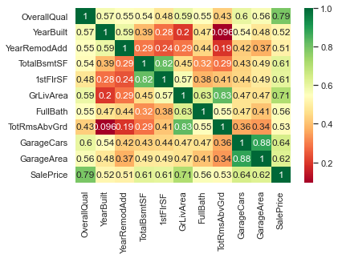

```python
# This Python 3 environment comes with many helpful analytics libraries installed
# It is defined by the kaggle/python docker image: https://github.com/kaggle/docker-python
# For example, here's several helpful packages to load in 

import numpy as np # linear algebra
import pandas as pd # data processing, CSV file I/O (e.g. pd.read_csv)

# Input data files are available in the "../input/" directory.
# For example, running this (by clicking run or pressing Shift+Enter) will list the files in the input directory

from datetime import datetime
from scipy.stats import skew  # for some statistics
from scipy.special import boxcox1p
from scipy.stats import boxcox_normmax
from sklearn import ensemble, tree, linear_model
from sklearn.model_selection import KFold, cross_val_score, train_test_split
from sklearn.metrics import r2_score, mean_squared_error
import matplotlib.pyplot as plt
import scipy.stats as stats
import sklearn.linear_model as linear_model
import seaborn as sns
from sklearn.manifold import TSNE
from sklearn.cluster import KMeans
from sklearn.decomposition import PCA
from sklearn.preprocessing import StandardScaler
import xgboost as xgb

import os
print(os.listdir("G:\我的雲端硬碟\求職\kaggle\practice - House Prices - Advanced Regression Techniques"))

import warnings
warnings.filterwarnings('ignore')

# Any results you write to the current directory are saved as output.
```

    ['house-prices-advanced-regression-techniques.zip', 'House Prices.gdoc', 'data_description.txt', 'sample_submission.csv', 'test.csv', 'train.csv', '2022_04_11.csv', '2022_04_12.csv']
    

# Load Data


```python
train = pd.read_csv('G:\我的雲端硬碟\求職\kaggle\practice - House Prices - Advanced Regression Techniques\\train.csv')
test = pd.read_csv('G:\我的雲端硬碟\求職\kaggle\practice - House Prices - Advanced Regression Techniques\\test.csv')
print ("Data is loaded!")
```

    Data is loaded!
    


```python
print ("Train: ",train.shape[0],"sales, and ",train.shape[1],"features")
print ("Test: ",test.shape[0],"sales, and ",test.shape[1],"features")
```

    Train:  1460 sales, and  81 features
    Test:  1459 sales, and  80 features
    


```python
train.head()
```


<div>
<style scoped>
    .dataframe tbody tr th:only-of-type {
        vertical-align: middle;
    }

    .dataframe tbody tr th {
        vertical-align: top;
    }

    .dataframe thead th {
        text-align: right;
    }
</style>
<table border="1" class="dataframe">
  <thead>
    <tr style="text-align: right;">
      <th></th>
      <th>Id</th>
      <th>MSSubClass</th>
      <th>MSZoning</th>
      <th>LotFrontage</th>
      <th>LotArea</th>
      <th>Street</th>
      <th>Alley</th>
      <th>LotShape</th>
      <th>LandContour</th>
      <th>Utilities</th>
      <th>...</th>
      <th>PoolArea</th>
      <th>PoolQC</th>
      <th>Fence</th>
      <th>MiscFeature</th>
      <th>MiscVal</th>
      <th>MoSold</th>
      <th>YrSold</th>
      <th>SaleType</th>
      <th>SaleCondition</th>
      <th>SalePrice</th>
    </tr>
  </thead>
  <tbody>
    <tr>
      <th>0</th>
      <td>1</td>
      <td>60</td>
      <td>RL</td>
      <td>65.0</td>
      <td>8450</td>
      <td>Pave</td>
      <td>NaN</td>
      <td>Reg</td>
      <td>Lvl</td>
      <td>AllPub</td>
      <td>...</td>
      <td>0</td>
      <td>NaN</td>
      <td>NaN</td>
      <td>NaN</td>
      <td>0</td>
      <td>2</td>
      <td>2008</td>
      <td>WD</td>
      <td>Normal</td>
      <td>208500</td>
    </tr>
    <tr>
      <th>1</th>
      <td>2</td>
      <td>20</td>
      <td>RL</td>
      <td>80.0</td>
      <td>9600</td>
      <td>Pave</td>
      <td>NaN</td>
      <td>Reg</td>
      <td>Lvl</td>
      <td>AllPub</td>
      <td>...</td>
      <td>0</td>
      <td>NaN</td>
      <td>NaN</td>
      <td>NaN</td>
      <td>0</td>
      <td>5</td>
      <td>2007</td>
      <td>WD</td>
      <td>Normal</td>
      <td>181500</td>
    </tr>
    <tr>
      <th>2</th>
      <td>3</td>
      <td>60</td>
      <td>RL</td>
      <td>68.0</td>
      <td>11250</td>
      <td>Pave</td>
      <td>NaN</td>
      <td>IR1</td>
      <td>Lvl</td>
      <td>AllPub</td>
      <td>...</td>
      <td>0</td>
      <td>NaN</td>
      <td>NaN</td>
      <td>NaN</td>
      <td>0</td>
      <td>9</td>
      <td>2008</td>
      <td>WD</td>
      <td>Normal</td>
      <td>223500</td>
    </tr>
    <tr>
      <th>3</th>
      <td>4</td>
      <td>70</td>
      <td>RL</td>
      <td>60.0</td>
      <td>9550</td>
      <td>Pave</td>
      <td>NaN</td>
      <td>IR1</td>
      <td>Lvl</td>
      <td>AllPub</td>
      <td>...</td>
      <td>0</td>
      <td>NaN</td>
      <td>NaN</td>
      <td>NaN</td>
      <td>0</td>
      <td>2</td>
      <td>2006</td>
      <td>WD</td>
      <td>Abnorml</td>
      <td>140000</td>
    </tr>
    <tr>
      <th>4</th>
      <td>5</td>
      <td>60</td>
      <td>RL</td>
      <td>84.0</td>
      <td>14260</td>
      <td>Pave</td>
      <td>NaN</td>
      <td>IR1</td>
      <td>Lvl</td>
      <td>AllPub</td>
      <td>...</td>
      <td>0</td>
      <td>NaN</td>
      <td>NaN</td>
      <td>NaN</td>
      <td>0</td>
      <td>12</td>
      <td>2008</td>
      <td>WD</td>
      <td>Normal</td>
      <td>250000</td>
    </tr>
  </tbody>
</table>
<p>5 rows × 81 columns</p>
</div>


# EDA

> There are 1460 instances of training data and 1460 of test data. Total number of attributes equals 81, of which 36 is quantitative, 43 categorical + Id and SalePrice.

#### Quantitative: 
> 1stFlrSF, 2ndFlrSF, 3SsnPorch, BedroomAbvGr, BsmtFinSF1, BsmtFinSF2, BsmtFullBath, BsmtHalfBath, BsmtUnfSF, EnclosedPorch, Fireplaces, FullBath, GarageArea, GarageCars, GarageYrBlt, GrLivArea, HalfBath, KitchenAbvGr, LotArea, LotFrontage, LowQualFinSF, MSSubClass, MasVnrArea, MiscVal, MoSold, OpenPorchSF, OverallCond, OverallQual, PoolArea, ScreenPorch, TotRmsAbvGrd, TotalBsmtSF, WoodDeckSF, YearBuilt, YearRemodAdd, YrSold

#### Qualitative: 
> Alley, BldgType, BsmtCond, BsmtExposure, BsmtFinType1, BsmtFinType2, BsmtQual, CentralAir, Condition1, Condition2, Electrical, ExterCond, ExterQual, Exterior1st, Exterior2nd, Fence, FireplaceQu, Foundation, Functional, GarageCond, GarageFinish, GarageQual, GarageType, Heating, HeatingQC, HouseStyle, KitchenQual, LandContour, LandSlope, LotConfig, LotShape, MSZoning, MasVnrType, MiscFeature, Neighborhood, PavedDrive, PoolQC, RoofMatl, RoofStyle, SaleCondition, SaleType, Street, Utilities,


```python
quantitative = [f for f in train.columns if train.dtypes[f] != 'object']
quantitative.remove('SalePrice')
quantitative.remove('Id')
qualitative = [f for f in train.columns if train.dtypes[f] == 'object']
```

## NAs


```python
sns.set_style("whitegrid")
missing = train.isnull().sum()
missing = missing[missing > 0]
missing.sort_values(inplace=True)
missing.plot.bar()
```


    <AxesSubplot:>


    

    


#### description:
> 19 attributes have missing values, 5 over 50% of all data. Most of times NA means lack of subject described by attribute, like missing pool, fence, no garage and basement.

## Observe the distributions of variables

##### target


```python
y = train['SalePrice']
plt.figure(1); plt.title('Johnson SU')
sns.distplot(y, kde=False, fit=stats.johnsonsu)
plt.figure(2); plt.title('Normal')
sns.distplot(y, kde=False, fit=stats.norm)
plt.figure(3); plt.title('Log Normal')
sns.distplot(y, kde=False, fit=stats.lognorm)
```


    <AxesSubplot:title={'center':'Log Normal'}, xlabel='SalePrice'>


    

    


    

    


    

    


#### description:
> It is apparent that SalePrice doesn't follow normal distribution, so before performing regression it has to be transformed. While log transformation does pretty good job, best fit is unbounded Johnson distribution.

##### other variables


```python
test_normality = lambda x: stats.shapiro(x.fillna(0))[1] < 0.01
normal = pd.DataFrame(train[quantitative])
normal = normal.apply(test_normality)
print(not normal.any())
```

    False
    

> Also none of quantitative variables has normal distribution so these should be transformed as well

#### Spearman 
> better to work with in this case because it picks up relationships between variables even when they are nonlinear. OverallQual is main criterion in establishing house price. Neighborhood has big influence, partially it has some intrisinc value in itself, but also houses in certain regions tend to share same characteristics (confunding) what causes similar valuations.


```python
def encode(frame, feature, frame2):
    ordering = pd.DataFrame()
    ordering['val'] = frame[feature].unique()
    ordering.index = ordering.val
    ordering['spmean'] = frame[[feature, 'SalePrice']].groupby(feature).mean()['SalePrice']
    ordering = ordering.sort_values('spmean')
    ordering['ordering'] = range(1, ordering.shape[0]+1)
    ordering = ordering['ordering'].to_dict()
    
    for cat, o in ordering.items():
        frame2.loc[frame[feature] == cat, feature+'_E'] = o
    
qual_encoded = []
spear_corr_df = train.copy()

for q in qualitative:  
    encode(train, q, spear_corr_df)
    qual_encoded.append(q+'_E')
print(qual_encoded)
```

    ['MSZoning_E', 'Street_E', 'Alley_E', 'LotShape_E', 'LandContour_E', 'Utilities_E', 'LotConfig_E', 'LandSlope_E', 'Neighborhood_E', 'Condition1_E', 'Condition2_E', 'BldgType_E', 'HouseStyle_E', 'RoofStyle_E', 'RoofMatl_E', 'Exterior1st_E', 'Exterior2nd_E', 'MasVnrType_E', 'ExterQual_E', 'ExterCond_E', 'Foundation_E', 'BsmtQual_E', 'BsmtCond_E', 'BsmtExposure_E', 'BsmtFinType1_E', 'BsmtFinType2_E', 'Heating_E', 'HeatingQC_E', 'CentralAir_E', 'Electrical_E', 'KitchenQual_E', 'Functional_E', 'FireplaceQu_E', 'GarageType_E', 'GarageFinish_E', 'GarageQual_E', 'GarageCond_E', 'PavedDrive_E', 'PoolQC_E', 'Fence_E', 'MiscFeature_E', 'SaleType_E', 'SaleCondition_E']
    

> Code above is donig label encoding, the number of encoding is according to the order of mean SalePrice of the category. <br>
e.g: In MSZoning, C (all) has the highest mean SalePrice, which encoding number is 1, RM is 2, RH is 3, and so on. <br> <br>
As a result, the variables become rank variables.


```python
def spearman(frame, features):
    spr = pd.DataFrame()
    spr['feature'] = features
    spr['spearman'] = [frame[f].corr(frame['SalePrice'], 'spearman') for f in features]
    spr = spr.sort_values('spearman')
    plt.figure(figsize=(6, 0.25*len(features)))
    sns.barplot(data=spr, y='feature', x='spearman', orient='h')
    
features = quantitative + qual_encoded
spearman(spear_corr_df, features)
```


    

    


```python
plt.figure(1)
corr = train[quantitative+['SalePrice']].corr()
sns.heatmap(corr)

plt.figure(2)
corr = spear_corr_df[qual_encoded+['SalePrice']].corr()
sns.heatmap(corr)

plt.figure(3)
corr = pd.DataFrame(np.zeros([len(quantitative)+1, len(qual_encoded)+1]), index=quantitative+['SalePrice'], columns=qual_encoded+['SalePrice'])
for q1 in quantitative+['SalePrice']:
    for q2 in qual_encoded+['SalePrice']:
        corr.loc[q1, q2] = spear_corr_df[q1].corr(spear_corr_df[q2])
sns.heatmap(corr)
```


    <AxesSubplot:>


    

    


    

    


    

    


```python
# most correlated features
plt.figure(4)
corr = train[quantitative+['SalePrice']].corr()
top_corr = corr.index[abs(corr['SalePrice'])>0.5]
sns.heatmap(train[top_corr].corr(),annot=True,cmap="RdYlGn")

# the ordering of correlation
corr['SalePrice'].sort_values(ascending = False)
```


    SalePrice        1.000000
    OverallQual      0.790982
    GrLivArea        0.708624
    GarageCars       0.640409
    GarageArea       0.623431
    TotalBsmtSF      0.613581
    1stFlrSF         0.605852
    FullBath         0.560664
    TotRmsAbvGrd     0.533723
    YearBuilt        0.522897
    YearRemodAdd     0.507101
    GarageYrBlt      0.486362
    MasVnrArea       0.477493
    Fireplaces       0.466929
    BsmtFinSF1       0.386420
    LotFrontage      0.351799
    WoodDeckSF       0.324413
    2ndFlrSF         0.319334
    OpenPorchSF      0.315856
    HalfBath         0.284108
    LotArea          0.263843
    BsmtFullBath     0.227122
    BsmtUnfSF        0.214479
    BedroomAbvGr     0.168213
    ScreenPorch      0.111447
    PoolArea         0.092404
    MoSold           0.046432
    3SsnPorch        0.044584
    BsmtFinSF2      -0.011378
    BsmtHalfBath    -0.016844
    MiscVal         -0.021190
    LowQualFinSF    -0.025606
    YrSold          -0.028923
    OverallCond     -0.077856
    MSSubClass      -0.084284
    EnclosedPorch   -0.128578
    KitchenAbvGr    -0.135907
    Name: SalePrice, dtype: float64


    

    


# Observe variables which highly correlated with target


```python
sns.set()
col_scatterplot = ['SalePrice', 'OverallQual', 'GarageArea','GrLivArea', 'GarageCars', 'TotalBsmtSF',
                   'FullBath','1stFlrSF']
sns.pairplot(train[col_scatterplot],size = 3)
plt.show()
```


    

    


#### Points:
> 1. GarageArea has some abnormal points when > 1500 <br>
2.GrLivArea when > 4500
3.TotalBsmtSF when > 6000
4.1stFlrSF when > 4000

# Data processing


```python
train.drop(['Id'], axis=1, inplace=True)
test.drop(['Id'], axis=1, inplace=True)

train = train[train.GrLivArea < 4500]
train = train[train.GarageArea < 1500]
train = train[train.TotalBsmtSF < 6000]
train = train[train['1stFlrSF'] < 4000]


train.reset_index(drop=True, inplace=True)
train["SalePrice"] = np.log1p(train["SalePrice"])
y = train['SalePrice'].reset_index(drop=True)
```

# Features


```python
train_features = train.drop(['SalePrice'], axis=1)
test_features = test
features = pd.concat([train_features, test_features]).reset_index(drop=True)
```

## Fill NAs


```python
# 参考kaggle上的思路：居住在一起的人LotFrontage是相似的，改用鄰居的LotFrontage填充， 原本是使用 0 填充
features['LotFrontage'] = features.groupby('Neighborhood')['LotFrontage'].transform(lambda x: x.fillna(x.median()))

# MSSubClass as str，since the variable is a type variable
features['MSSubClass'] = features['MSSubClass'].astype(str)

# MSZoning NA in pred. filling with most popular values  這裡我認為可能有問題，在未知區域的房子區域就用最常出現房子的區域來替代，可能有偏誤
features['MSZoning'] = features['MSZoning'].fillna(features['MSZoning'].mode()[0])

# Alley  NA in all. NA means no access
features['Alley'] = features['Alley'].fillna('NOACCESS')

# Converting OverallCond to str，since the variable is a type variable
features.OverallCond = features.OverallCond.astype(str)

# MasVnrType NA in all. filling with most popular values 此處我認為有別的做法，磚的類型 NA 可能表示 沒有磚或單純沒有蒐集到資料 None 或 popular value都可以
features['MasVnrType'] = features['MasVnrType'].fillna('None')

# TotalBsmtSF  NA in pred. I suppose NA means 0
features['TotalBsmtSF'] = features['TotalBsmtSF'].fillna(0)

# Electrical NA in pred. filling with most popular values
features['Electrical'] = features['Electrical'].fillna(features['Electrical'].mode()[0])

# KitchenAbvGr to categorical
features['KitchenAbvGr'] = features['KitchenAbvGr'].astype(str)

# KitchenQual NA in pred. filling with most popular values
features['KitchenQual'] = features['KitchenQual'].fillna(features['KitchenQual'].mode()[0])

# GarageCars  NA in pred. I suppose NA means 0
features['GarageCars'] = features['GarageCars'].fillna(0.0)

# SaleType NA in pred. filling with most popular values
features['SaleType'] = features['SaleType'].fillna(features['SaleType'].mode()[0])

# Year and Month to categorical
features['YrSold'] = features['YrSold'].astype(str)
features['MoSold'] = features['MoSold'].astype(str)

# MasVnrArea，since MasVnrType filled with most popular type
features['MasVnrArea'] = features["MasVnrArea"].fillna(0)

# BsmtFinSF1, BsmtFinSF2, BsmtUnfSF, NA means no basement
for col in ('BsmtFinSF1', 'BsmtFinSF2', 'BsmtUnfSF'):
    features[col] = features[col].fillna(0)

# BsmtFullBath, BsmtHalfBath are dummies, NA means 0
features['BsmtFullBath'] = features['BsmtFullBath'].fillna(0)
features['BsmtHalfBath'] = features['BsmtHalfBath'].fillna(0)

# Functional NA in pred. filling with most popular values
features['Functional'] = features['Functional'].fillna(features['Functional'].mode()[0])


# Fence NA in all. NA means no fence
features['Fence'] = features['Fence'].fillna("NoFen")

# MiscFeature NA in all. NA means None
features['MiscFeature'] = features['MiscFeature'].fillna('None')
```


```python
features = features.drop(['Utilities', 'Street', 'PoolQC',], axis=1)

features['YrBltAndRemod']=features['YearBuilt']+features['YearRemodAdd']
features['TotalSF']=features['TotalBsmtSF'] + features['1stFlrSF'] + features['2ndFlrSF']

features['Total_sqr_footage'] = (features['BsmtFinSF1'] + features['BsmtFinSF2'] +
                                 features['1stFlrSF'] + features['2ndFlrSF'])

features['Total_Bathrooms'] = (features['FullBath'] + (0.5 * features['HalfBath']) +
                               features['BsmtFullBath'] + (0.5 * features['BsmtHalfBath']))

features['Total_porch_sf'] = (features['OpenPorchSF'] + features['3SsnPorch'] +
                              features['EnclosedPorch'] + features['ScreenPorch'] +
                              features['WoodDeckSF'])
```


```python
features['haspool'] = features['PoolArea'].apply(lambda x: 1 if x > 0 else 0)
features['has2ndfloor'] = features['2ndFlrSF'].apply(lambda x: 1 if x > 0 else 0)

# BsmtQual, BsmtCond, BsmtExposure, BsmtFinType1, BsmtFinType2
# NA in all. NA means No basement
for col in ('BsmtQual', 'BsmtCond', 'BsmtExposure', 'BsmtFinType1', 'BsmtFinType2'):
    features[col] = features[col].fillna('NoBSMT')

# GarageYrBlt, GarageArea, GarageCond NA means No Garage
features["GarageYrBlt"] = features['GarageYrBlt'].astype(str)
features["GarageYrBlt"] = features['GarageYrBlt'].fillna("None")  # 這裡不能填0，年份會有問題 ; 也不能填'None' type不對，可以試試改成str
features["GarageArea"] = features["GarageArea"].fillna(0)
features["GarageCond"] = features["GarageCond"].fillna('NoGRG')

# GarageType, GarageFinish, GarageQual  NA in all. NA means No Garage
for col in ('GarageType', 'GarageFinish', 'GarageQual'):
    features[col] = features[col].fillna('NoGRG')

# FireplaceQu  NA in all. NA means No Fireplace
features['FireplaceQu'] = features['FireplaceQu'].fillna('NoFP')

```


```python
# numeric column
num_col = np.array(features.select_dtypes(include=[np.number]).columns)
features.update(features[num_col].fillna(0))
```

# Skewness


```python
skew_features = features[num_col].apply(lambda x: skew(x)).sort_values(ascending=False)

high_skew = skew_features[skew_features > 0.5]
skew_index = high_skew.index

for i in skew_index:
    features[i] = boxcox1p(features[i], boxcox_normmax(features[i] + 1))
```


```python
features.shape
```


    (2917, 83)


# Dummies


```python
# Getting Dummies from Condition1 and Condition2
conditions = set([x for x in features['Condition1']] + [x for x in features['Condition2']])
dummies = pd.DataFrame(data=np.zeros((len(features.index), len(conditions))),
                       index=features.index, columns=conditions)

# df.ix [row_index, column_name]的用法已廢棄，改使用 df.loc[df.index[row_index], column_name] 的方法
for i, cond in enumerate(zip(features['Condition1'], features['Condition2'])):
    dummies.loc[dummies.index[i], cond[0]] = 1
    if cond[0] != cond[1]:
        dummies.loc[dummies.index[i], cond[1]] = 1
features = pd.concat([features, dummies.add_prefix('Condition_')], axis=1)
features.drop(['Condition1', 'Condition2'], axis=1, inplace=True)

# Getting Dummies from Exterior1st and Exterior2nd
exteriors = set([x for x in features['Exterior1st']] + [x for x in features['Exterior2nd']])
dummies = pd.DataFrame(data=np.zeros((len(features.index), len(exteriors))),
                       index=features.index, columns=exteriors)
for i, ext in enumerate(zip(features['Exterior1st'], features['Exterior2nd'])):
    dummies.loc[dummies.index[i], ext[0]] = 1
    if ext[0] != ext[1]:
        dummies.loc[dummies.index[i], ext[1]] = 1
features = pd.concat([features, dummies.add_prefix('Exterior_')], axis=1)
features.drop(['Exterior1st', 'Exterior2nd', 'Exterior_nan'], axis=1, inplace=True)

final_features = pd.get_dummies(features).reset_index(drop=True)
final_features.shape
```


    (2917, 424)


```python
final_features
```


<div>
<style scoped>
    .dataframe tbody tr th:only-of-type {
        vertical-align: middle;
    }

    .dataframe tbody tr th {
        vertical-align: top;
    }

    .dataframe thead th {
        text-align: right;
    }
</style>
<table border="1" class="dataframe">
  <thead>
    <tr style="text-align: right;">
      <th></th>
      <th>LotFrontage</th>
      <th>LotArea</th>
      <th>OverallQual</th>
      <th>YearBuilt</th>
      <th>YearRemodAdd</th>
      <th>MasVnrArea</th>
      <th>BsmtFinSF1</th>
      <th>BsmtFinSF2</th>
      <th>BsmtUnfSF</th>
      <th>TotalBsmtSF</th>
      <th>...</th>
      <th>SaleType_ConLw</th>
      <th>SaleType_New</th>
      <th>SaleType_Oth</th>
      <th>SaleType_WD</th>
      <th>SaleCondition_Abnorml</th>
      <th>SaleCondition_AdjLand</th>
      <th>SaleCondition_Alloca</th>
      <th>SaleCondition_Family</th>
      <th>SaleCondition_Normal</th>
      <th>SaleCondition_Partial</th>
    </tr>
  </thead>
  <tbody>
    <tr>
      <th>0</th>
      <td>18.144577</td>
      <td>13.833055</td>
      <td>7</td>
      <td>2003</td>
      <td>2003</td>
      <td>19.433173</td>
      <td>144.117834</td>
      <td>0.0</td>
      <td>29.991052</td>
      <td>422.488482</td>
      <td>...</td>
      <td>0</td>
      <td>0</td>
      <td>0</td>
      <td>1</td>
      <td>0</td>
      <td>0</td>
      <td>0</td>
      <td>0</td>
      <td>1</td>
      <td>0</td>
    </tr>
    <tr>
      <th>1</th>
      <td>20.673630</td>
      <td>14.117918</td>
      <td>6</td>
      <td>1976</td>
      <td>1976</td>
      <td>0.000000</td>
      <td>181.719148</td>
      <td>0.0</td>
      <td>44.135410</td>
      <td>593.888137</td>
      <td>...</td>
      <td>0</td>
      <td>0</td>
      <td>0</td>
      <td>1</td>
      <td>0</td>
      <td>0</td>
      <td>0</td>
      <td>0</td>
      <td>1</td>
      <td>0</td>
    </tr>
    <tr>
      <th>2</th>
      <td>18.668051</td>
      <td>14.476513</td>
      <td>7</td>
      <td>2001</td>
      <td>2002</td>
      <td>17.768838</td>
      <td>110.441013</td>
      <td>0.0</td>
      <td>56.896528</td>
      <td>450.079686</td>
      <td>...</td>
      <td>0</td>
      <td>0</td>
      <td>0</td>
      <td>1</td>
      <td>0</td>
      <td>0</td>
      <td>0</td>
      <td>0</td>
      <td>1</td>
      <td>0</td>
    </tr>
    <tr>
      <th>3</th>
      <td>17.249654</td>
      <td>14.106197</td>
      <td>7</td>
      <td>1915</td>
      <td>1970</td>
      <td>0.000000</td>
      <td>61.795305</td>
      <td>0.0</td>
      <td>64.808848</td>
      <td>378.854543</td>
      <td>...</td>
      <td>0</td>
      <td>0</td>
      <td>0</td>
      <td>1</td>
      <td>1</td>
      <td>0</td>
      <td>0</td>
      <td>0</td>
      <td>0</td>
      <td>0</td>
    </tr>
    <tr>
      <th>4</th>
      <td>21.314287</td>
      <td>15.022009</td>
      <td>8</td>
      <td>2000</td>
      <td>2000</td>
      <td>25.404161</td>
      <td>136.624574</td>
      <td>0.0</td>
      <td>61.166371</td>
      <td>545.309889</td>
      <td>...</td>
      <td>0</td>
      <td>0</td>
      <td>0</td>
      <td>1</td>
      <td>0</td>
      <td>0</td>
      <td>0</td>
      <td>0</td>
      <td>1</td>
      <td>0</td>
    </tr>
    <tr>
      <th>...</th>
      <td>...</td>
      <td>...</td>
      <td>...</td>
      <td>...</td>
      <td>...</td>
      <td>...</td>
      <td>...</td>
      <td>...</td>
      <td>...</td>
      <td>...</td>
      <td>...</td>
      <td>...</td>
      <td>...</td>
      <td>...</td>
      <td>...</td>
      <td>...</td>
      <td>...</td>
      <td>...</td>
      <td>...</td>
      <td>...</td>
      <td>...</td>
    </tr>
    <tr>
      <th>2912</th>
      <td>8.726309</td>
      <td>10.765922</td>
      <td>4</td>
      <td>1970</td>
      <td>1970</td>
      <td>0.000000</td>
      <td>0.000000</td>
      <td>0.0</td>
      <td>65.236267</td>
      <td>284.720514</td>
      <td>...</td>
      <td>0</td>
      <td>0</td>
      <td>0</td>
      <td>1</td>
      <td>0</td>
      <td>0</td>
      <td>0</td>
      <td>0</td>
      <td>1</td>
      <td>0</td>
    </tr>
    <tr>
      <th>2913</th>
      <td>8.726309</td>
      <td>10.723223</td>
      <td>4</td>
      <td>1970</td>
      <td>1970</td>
      <td>0.000000</td>
      <td>69.030578</td>
      <td>0.0</td>
      <td>45.062865</td>
      <td>284.720514</td>
      <td>...</td>
      <td>0</td>
      <td>0</td>
      <td>0</td>
      <td>1</td>
      <td>1</td>
      <td>0</td>
      <td>0</td>
      <td>0</td>
      <td>0</td>
      <td>0</td>
    </tr>
    <tr>
      <th>2914</th>
      <td>31.755379</td>
      <td>15.820340</td>
      <td>5</td>
      <td>1960</td>
      <td>1996</td>
      <td>0.000000</td>
      <td>213.123269</td>
      <td>0.0</td>
      <td>0.000000</td>
      <td>578.174323</td>
      <td>...</td>
      <td>0</td>
      <td>0</td>
      <td>0</td>
      <td>1</td>
      <td>1</td>
      <td>0</td>
      <td>0</td>
      <td>0</td>
      <td>0</td>
      <td>0</td>
    </tr>
    <tr>
      <th>2915</th>
      <td>17.611142</td>
      <td>14.307159</td>
      <td>5</td>
      <td>1992</td>
      <td>1992</td>
      <td>0.000000</td>
      <td>85.016465</td>
      <td>0.0</td>
      <td>67.275001</td>
      <td>446.644115</td>
      <td>...</td>
      <td>0</td>
      <td>0</td>
      <td>0</td>
      <td>1</td>
      <td>0</td>
      <td>0</td>
      <td>0</td>
      <td>0</td>
      <td>1</td>
      <td>0</td>
    </tr>
    <tr>
      <th>2916</th>
      <td>19.687486</td>
      <td>14.124225</td>
      <td>7</td>
      <td>1993</td>
      <td>1994</td>
      <td>13.690161</td>
      <td>151.596076</td>
      <td>0.0</td>
      <td>39.680232</td>
      <td>482.538156</td>
      <td>...</td>
      <td>0</td>
      <td>0</td>
      <td>0</td>
      <td>1</td>
      <td>0</td>
      <td>0</td>
      <td>0</td>
      <td>0</td>
      <td>1</td>
      <td>0</td>
    </tr>
  </tbody>
</table>
<p>2917 rows × 424 columns</p>
</div>


# Splitting train and test features


```python
### Splitting features
train_features = final_features.iloc[:len(y),:]
test_features = final_features.iloc[len(y):,:]

overfit = []
for i in train_features.columns:
    counts = train_features[i].value_counts()
    zeros = counts.iloc[0]
    if zeros / len(train_features) * 100 > 99.94:
        overfit.append(i)

train_features = train_features.drop(overfit, axis=1).select_dtypes(include=[np.number]).values
test_features = test_features.drop(overfit, axis=1).select_dtypes(include=[np.number]).values
```


```python
# Prints R2 and RMSE scores
def get_score(prediction, lables):    
    print('R2: {}'.format(r2_score(prediction, lables)))
    print('RMSE: {}'.format(np.sqrt(mean_squared_error(prediction, lables))))

# use K-fold to evaluate models
n_folds = 5

def resle_cv(model):
    kf = KFold(n_folds,shuffle = True,random_state = 42).get_n_splits(train_features, y)
    rmse = np.sqrt(-cross_val_score(model,train_features, y,
                                    scoring='neg_mean_squared_error',
                                   cv = kf))
    return (rmse)

# Shows scores for train and validation sets    
def train_test(estimator, x_trn, x_tst, y_trn, y_tst):
    prediction_train = estimator.predict(x_trn)
    # Printing estimator
    print(estimator)
    # Printing train scores
    get_score(prediction_train, y_trn)
    prediction_test = estimator.predict(x_tst)
    # Printing test scores
    print("Test")
    get_score(prediction_test, y_tst)
```


```python
### Splitting
x_train, x_test, y_train, y_test = train_test_split(train_features, y, test_size=0.1, random_state=200)
```

# First level models

## Elastic Net


```python
ENSTest = linear_model.ElasticNetCV(alphas=[0.0001, 0.0005, 0.001, 0.01, 0.1, 1, 10], l1_ratio=[.01, .1, .5, .9, .99], max_iter=10000).fit(x_train, y_train)
train_test(ENSTest, x_train, x_test, y_train, y_test)
ElasticNetCV(alphas=[0.0001, 0.0005, 0.001, 0.01, 0.1, 1, 10],
             l1_ratio=[0.01, 0.1, 0.5, 0.9, 0.99], max_iter=10000)
```

    ElasticNetCV(alphas=[0.0001, 0.0005, 0.001, 0.01, 0.1, 1, 10],
                 l1_ratio=[0.01, 0.1, 0.5, 0.9, 0.99], max_iter=10000)
    R2: 0.9386371130925185
    RMSE: 0.0956283584843377
    Test
    R2: 0.9307287223890648
    RMSE: 0.09481775357056739
    


    ElasticNetCV(alphas=[0.0001, 0.0005, 0.001, 0.01, 0.1, 1, 10],
                 l1_ratio=[0.01, 0.1, 0.5, 0.9, 0.99], max_iter=10000)


```python
# Average R2 score and standart deviation of 5-fold cross-validation
scores = cross_val_score(ENSTest, train_features, y, cv=5)
print("Accuracy: %0.2f (+/- %0.2f)" % (scores.mean(), scores.std() * 2))

score_model_ENS = resle_cv(ENSTest)
score_model_ENS = [score_model_ENS.mean(),score_model_ENS.std()]
score_model_ENS
```

    Accuracy: 0.92 (+/- 0.01)
    


    [0.10973119676035079, 0.005458164528315808]


# Gradient Boosting


```python
GBest = ensemble.GradientBoostingRegressor(n_estimators=3000, learning_rate=0.05, max_depth=3, max_features='sqrt',
                                               min_samples_leaf=15, min_samples_split=10, loss='huber').fit(x_train, y_train)
train_test(GBest, x_train, x_test, y_train, y_test)
GradientBoostingRegressor(learning_rate=0.05, loss='huber', max_features='sqrt',
                          min_samples_leaf=15, min_samples_split=10,
                          n_estimators=3000)
```

    GradientBoostingRegressor(learning_rate=0.05, loss='huber', max_features='sqrt',
                              min_samples_leaf=15, min_samples_split=10,
                              n_estimators=3000)
    R2: 0.9734874089513311
    RMSE: 0.06309185748837677
    Test
    R2: 0.9313802727588235
    RMSE: 0.09439244343371668
    


    GradientBoostingRegressor(learning_rate=0.05, loss='huber', max_features='sqrt',
                              min_samples_leaf=15, min_samples_split=10,
                              n_estimators=3000)


```python
# Average R2 score and standart deviation of 5-fold cross-validation
scores = cross_val_score(GBest, train_features, y, cv=5)
print("Accuracy: %0.2f (+/- %0.2f)" % (scores.mean(), scores.std() * 2))

score_model_GBest = resle_cv(GBest)
score_model_GBest = [score_model_GBest.mean(),score_model_GBest.std()]
score_model_GBest
```

    Accuracy: 0.92 (+/- 0.01)
    


    [0.11454913536018244, 0.007454920793554418]


# Lasso


```python
LassoTest = linear_model.LassoCV(alphas = [1,0.1,0.001,0.005], max_iter=1000).fit(x_train, y_train)
train_test(LassoTest, x_train, x_test, y_train, y_test)
LassoCV(alphas=[1, 0.1, 0.001, 0.005], copy_X=True, cv=None, eps=0.001,
    fit_intercept=True, max_iter=1000, n_alphas=100, n_jobs=1,
    normalize=False, positive=False, precompute='auto', random_state=None,
    selection='cyclic', tol=0.0001, verbose=False)
```

    LassoCV(alphas=[1, 0.1, 0.001, 0.005])
    R2: 0.926502513814034
    RMSE: 0.10379204740273613
    Test
    R2: 0.923259107455131
    RMSE: 0.09890552415570525
    


    LassoCV(alphas=[1, 0.1, 0.001, 0.005], n_jobs=1, normalize=False)


```python
# Average R2 score and standart deviation of 5-fold cross-validation
scores = cross_val_score(LassoTest, train_features, y, cv=5)
print("Accuracy: %0.2f (+/- %0.2f)" % (scores.mean(), scores.std() * 2))

score_model_Lasso = resle_cv(LassoTest)
score_model_Lasso = [score_model_Lasso.mean(),score_model_Lasso.std()]
score_model_Lasso
```

    Accuracy: 0.92 (+/- 0.01)
    


    [0.11311436482433548, 0.004868566916024191]


# XGBoost


```python
model_xgb = xgb.XGBRegressor(colsample_bytree=0.4603, gamma=0.0468, 
                             learning_rate=0.05, max_depth=3, 
                             min_child_weight=1.7817, n_estimators=2200,
                             reg_alpha=0.4640, reg_lambda=0.8571,
                             subsample=0.5213, silent=1,
                             random_state =7, nthread = -1, verbosity=0).fit(x_train, y_train)

train_test(model_xgb, x_train, x_test, y_train, y_test)

XGBRegressor(base_score=0.5, booster='gbtree', colsample_bylevel=1,
       colsample_bytree=0.4603, gamma=0.0468, learning_rate=0.05,
       max_delta_step=0, max_depth=3, min_child_weight=1.7817,
       missing=None, n_estimators=2200, n_jobs=1, nthread=-1,
       objective='reg:linear', random_state=7, reg_alpha=0.464,
       reg_lambda=0.8571, scale_pos_weight=1, seed=None, silent=1,
       subsample=0.5213)
```

    XGBRegressor(base_score=0.5, booster='gbtree', colsample_bylevel=1,
                 colsample_bynode=1, colsample_bytree=0.4603,
                 enable_categorical=False, gamma=0.0468, gpu_id=-1,
                 importance_type=None, interaction_constraints='',
                 learning_rate=0.05, max_delta_step=0, max_depth=3,
                 min_child_weight=1.7817, missing=nan, monotone_constraints='()',
                 n_estimators=2200, n_jobs=12, nthread=-1, num_parallel_tree=1,
                 predictor='auto', random_state=7, reg_alpha=0.464,
                 reg_lambda=0.8571, scale_pos_weight=1, silent=1, subsample=0.5213,
                 tree_method='exact', validate_parameters=1, verbosity=0)
    R2: 0.9579075210803186
    RMSE: 0.07953425308265795
    Test
    R2: 0.9224514498122156
    RMSE: 0.0986306268647821
    


    XGBRegressor(base_score=0.5, booster='gbtree', colsample_bylevel=1,
                 colsample_bynode=None, colsample_bytree=0.4603,
                 enable_categorical=False, gamma=0.0468, gpu_id=None,
                 importance_type=None, interaction_constraints=None,
                 learning_rate=0.05, max_delta_step=0, max_depth=3,
                 min_child_weight=1.7817, missing=None, monotone_constraints=None,
                 n_estimators=2200, n_jobs=1, nthread=-1, num_parallel_tree=None,
                 objective='reg:linear', predictor=None, random_state=7,
                 reg_alpha=0.464, reg_lambda=0.8571, scale_pos_weight=1, seed=None,
                 silent=1, subsample=0.5213, tree_method=None, ...)


```python
# Average R2 score and standart deviation of 5-fold cross-validation
scores = cross_val_score(model_xgb, train_features, y, cv=5)
print("Accuracy: %0.2f (+/- %0.2f)" % (scores.mean(), scores.std() * 2))

score_model_xgb = resle_cv(model_xgb)
score_model_xgb = [score_model_xgb.mean(),score_model_xgb.std()]
score_model_xgb
```

    Accuracy: 0.92 (+/- 0.01)
    


    [0.11613205944118954, 0.006268103079938527]


# Ensembling final model


```python
# Retraining models
GB_model = GBest.fit(train_features, y)
ENST_model = ENSTest.fit(train_features, y)
Lasso_model = LassoTest.fit(train_features, y)
XGB_model = model_xgb.fit(train_features, y)

## Getting our SalePrice estimation
Final_labels = (np.exp(GB_model.predict(test_features)) + np.exp(ENST_model.predict(test_features)) + np.exp(Lasso_model.predict(test_features)) + np.exp(XGB_model.predict(test_features))) / 4

## Saving to CSV
ID = pd.read_csv("G:\我的雲端硬碟\求職\kaggle\practice - House Prices - Advanced Regression Techniques\sample_submission.csv").iloc[:,0]
pd.DataFrame({'Id': ID, 'SalePrice': Final_labels}).to_csv("G:\我的雲端硬碟\求職\kaggle\practice - House Prices - Advanced Regression Techniques\\2022_04_12.csv", index =False)    
```

#### Reference: 
1. https://www.kaggle.com/code/neviadomski/how-to-get-to-top-25-with-simple-model-sklearn/notebook
2. https://zhuanlan.zhihu.com/p/46855142
3. https://www.kaggle.com/code/jesucristo/1-house-prices-solution-top-1/notebook?scriptVersionId=12846740


```python

```
